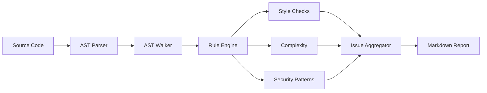
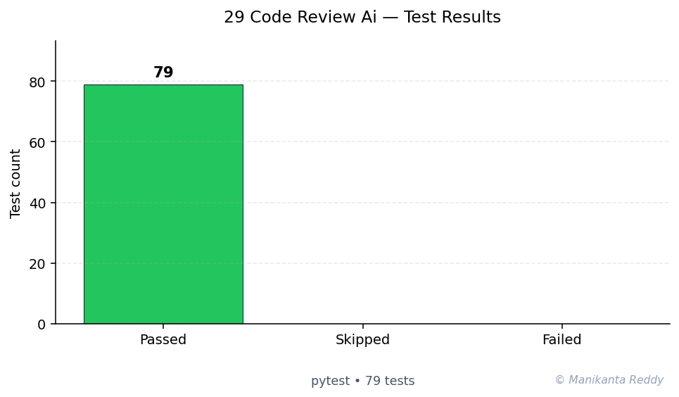

<h1 align="center">CodeReview AI</h1>

<p align="center">
  <strong>AI-powered Code Review Assistant for Python</strong>
</p>

<p align="center">
  
  
  
  
  
</p>

---

## Table of Contents

- [Overview](#overview)
- [Features](#features)
- [Screenshots](#screenshots)
- [Installation](#installation)
- [Quick Start](#quick-start)
- [Usage](#usage)
- [Configuration](#configuration)
- [Architecture](#architecture)
- [Tech Stack](#tech-stack)
- [Future Improvements](#future-improvements)
- [Contributing](#contributing)
- [License](#license)

---

## Overview

CodeReview AI is an intelligent, **zero-dependency** Python tool that performs automated code reviews on Python source files. It uses Python's built-in `ast` (Abstract Syntax Tree) module for deep code understanding, detecting everything from style violations to critical security vulnerabilities.

### Why CodeReview AI?

- **No external dependencies** - Uses only Python's standard library
- **AST-powered analysis** - Deep code understanding, not just regex
- **Multiple output formats** - HTML, Markdown, JSON, and colorful CLI
- **Configurable rule engine** - Enable/disable rules as needed
- **AI-powered suggestions** - Context-aware fix recommendations
- **Self-analyzing** - The tool can analyze itself

---

## Features

### Static Analysis

| Category | Checks |
|----------|--------|
| **Complexity** | Cyclomatic complexity, cognitive complexity, nesting depth, function length |
| **Naming** | PEP 8 conventions, built-in shadowing, keyword names, single-char names |
| **Documentation** | Docstring coverage, quality, missing docstrings, TODO/FIXME detection |
| **Style** | Line length, trailing whitespace, mutable defaults, import order, bare except |

### Security Scanning

| Check | Severity |
|-------|----------|
| Dangerous function calls (`eval`, `exec`) | Critical |
| Hardcoded secrets and credentials | Critical |
| SQL injection patterns | Critical |
| Weak hash algorithms (MD5, SHA1) | Warning |
| Wildcard imports | Warning |
| Debug mode enabled | Error |

### Code Smell Detection

- Duplicate code blocks
- God Class identification
- Feature envy detection
- Long parameter lists
- Dead code detection
- Data class opportunities

### Anti-Pattern Detection

- `except: pass` patterns
- `type()` instead of `isinstance()`
- Mutable default arguments
- String comparison with `is`
- Missing context managers

### Scoring & Grading

- Weighted category scoring (security: 2.0x, style: 0.5x)
- Letter grades: A+ through F
- Color-coded severity levels
- Improvement recommendations

### Report Generation

| Format | Features |
|--------|----------|
| **HTML** | Dark theme, interactive, score bars, badges |
| **Markdown** | GitHub-flavored, badges, tables |
| **JSON** | Machine-readable, full metadata |
| **CLI** | Colorful, emoji indicators, progress tracking |

---

## Screenshots

### CLI Output

```
  ____          _       _                  _       ___
 / ___|___   __| | ___ | | _____   ___ __ (_) ___ |_ _|
| |   / _ \ / _` |/ _ \| |/ / _ \ / __/ _ \| |/ _ \| |
| |__| (_) | (_| | (_) |   <  __/| (_| (_) | |  __/| |
 \____\___/ \__,_|\___/|_|\_\___(_)___\___/|_|\___||___|

  [1/3] src/analyzer.py
  Score: 87.5/100  Grade: B+  PASS
  Issues: 2 warning, 1 info

  [2/3] src/cli.py
  Score: 92.3/100  Grade: A-  PASS
  Issues: 1 info

  [3/3] src/config.py
  Score: 95.1/100  Grade: A  PASS
  No issues found!

============================================================
  CODE REVIEW SUMMARY
============================================================
  Overall Grade: B+
  Overall Score: 91.6/100
  Status: PASSED
  Files Analyzed: 3
  Total Issues: 4
============================================================
```

### HTML Report

The HTML report features a modern dark theme with:
- Interactive severity badges
- Animated score bars
- Expandable file sections
- Color-coded grades
- Responsive design

### Markdown Report

```markdown
## Overall Result: PASS

| Metric | Value |
|--------|-------|
| **Score** | 91.6/100 |
| **Grade** | B+ |
| **Status** | PASSED |

## Severity Breakdown

| Severity | Count |
|----------|-------|
| Info | 2 |
| Warning | 2 |
| Error | 0 |
| Critical | 0 |
```

---

## Installation

### From Source

```bash
git clone https://github.com/codereview-ai/codereview-ai.git
cd codereview-ai
pip install -e .
```

### Requirements

- Python 3.9 or higher
- No external runtime dependencies

### Development Dependencies

```bash
pip install -r requirements.txt
```

---

## Quick Start

### Analyze a Single File

```bash
python -m src.cli analyze myfile.py
```

### Analyze a Directory

```bash
python -m src.cli analyze src/
```

### Generate HTML Report

```bash
python -m src.cli analyze src/ --format html --output report.html
```

### Self-Analysis

```bash
python -m src.cli self-analyze
```

---

## Usage

### CLI Commands

```bash
# Basic analysis
python -m src.cli analyze <path>

# Generate HTML report
python -m src.cli analyze <path> -f html -o report.html

# Generate Markdown report
python -m src.cli analyze <path> -f markdown -o report.md

# Generate JSON report
python -m src.cli analyze <path> -f json -o report.json

# Custom fail threshold
python -m src.cli analyze <path> --fail-threshold 80

# Use custom configuration
python -m src.cli analyze <path> -c myconfig.json

# Disable AI suggestions
python -m src.cli analyze <path> --no-suggestions

# Non-recursive analysis
python -m src.cli analyze <path> --no-recursive

# Initialize configuration
python -m src.cli config init

# Show current configuration
python -m src.cli config show

# Self-analysis
python -m src.cli self-analyze
```

### Pre-commit Hook

Install the pre-commit hook:

```bash
# From project root
cp hooks/pre-commit .git/hooks/
chmod +x .git/hooks/pre-commit

# Or create a symlink
ln -s ../../hooks/pre-commit .git/hooks/pre-commit
```

Configure via environment variables:

```bash
# Set custom threshold
CODEREVIEW_THRESHOLD=80 git commit

# Use custom config
CODEREVIEW_CONFIG=.codereview.json git commit

# Skip check (emergency)
git commit --no-verify
```

---

## Configuration

### Configuration File

Create `.codereview.json` in your project root:

```json
{
  "max_line_length": 88,
  "max_function_length": 50,
  "max_cyclomatic_complexity": 10,
  "fail_threshold": 70.0,
  "rules": {
    "complexity": {"enabled": true, "threshold": 10},
    "naming": {"enabled": true, "convention": "snake_case"},
    "documentation": {"enabled": true, "require_docstrings": true},
    "security": {"enabled": true, "scan_secrets": true},
    "performance": {"enabled": true},
    "style": {"enabled": true, "max_line_length": 88}
  },
  "ignore_patterns": [
    "__pycache__",
    ".git",
    "venv",
    "node_modules"
  ],
  "report_format": "html"
}
```

### Configuration via pyproject.toml

```toml
[tool.codereview]
max_line_length = 88
max_cyclomatic_complexity = 10
fail_threshold = 70.0
report_format = "html"
```

### Environment Variables

| Variable | Description |
|----------|-------------|
| `CODEREVIEW_THRESHOLD` | Minimum score to pass (default: 70) |
| `CODEREVIEW_FORMAT` | Report format (default: console) |
| `CODEREVIEW_CONFIG` | Path to config file |

---

## Architecture

```
+------------------+     +------------------+     +------------------+
|     CLI          |---->|   CodeAnalyzer   |---->|   AST Parser     |
|   (cli.py)       |     |  (analyzer.py)   |     | (ast_parser.py)  |
+------------------+     +--------+---------+     +------------------+
                                  |
                    +-------------+-------------+
                    |             |             |
           +--------v---+  +------v-----+  +----v-----------+
           |   Rules    |  | Detectors  |  |  Suggestions   |
           | (rules/)   |  |(detectors/)|  |  (engine.py)   |
           +------------+  +------------+  +----------------+
                    |             |             |
                    +-------------+-------------+
                                  |
                    +-------------v-------------+
                    |       Scoring             |
                    |    (scoring/)             |
                    +-------------+-------------+
                                  |
                    +-------------v-------------+
                    |       Reports             |
                    |    (reports/)             |
                    |  HTML / MD / JSON         |
                    +---------------------------+
```

### Key Design Decisions

1. **Zero external dependencies** - Uses only Python's standard library for maximum portability
2. **AST-based analysis** - Deep code understanding through Python's `ast` module
3. **Pluggable rule engine** - Easy to extend with new rules and detectors
4. **Immutable data classes** - Reports and issues are immutable for reliability
5. **Category-weighted scoring** - Security issues penalize more than style issues
6. **Multi-format output** - Reports rendered independently from analysis

---

## Tech Stack

| Component | Technology |
|-----------|------------|
| Language | Python 3.9+ |
| AST Parsing | `ast` (standard library) |
| CLI | `argparse` (standard library) |
| Data Classes | `dataclasses` (standard library) |
| Type Hints | Full type annotation |
| Testing | pytest |
| Formatting | Black |
| Type Checking | mypy |
| Build | setuptools + pyproject.toml |

---

## Project Structure

```
project_29_code_review_ai/
├── src/                          # Source code
│   ├── __init__.py               # Package init
│   ├── cli.py                    # Command-line interface
│   ├── analyzer.py               # Core analyzer
│   ├── ast_parser.py             # AST parsing utilities
│   ├── config.py                 # Configuration management
│   ├── rules/                    # Rule modules
│   │   ├── __init__.py
│   │   ├── complexity.py
│   │   ├── naming.py
│   │   ├── documentation.py
│   │   ├── security.py
│   │   ├── performance.py
│   │   └── style.py
│   ├── detectors/                # Detector modules
│   │   ├── __init__.py
│   │   ├── code_smells.py
│   │   ├── security_risks.py
│   │   └── anti_patterns.py
│   ├── scoring/                  # Scoring module
│   │   ├── __init__.py
│   │   ├── calculator.py
│   │   └── grading.py
│   ├── reports/                  # Report generators
│   │   ├── __init__.py
│   │   ├── html_reporter.py
│   │   ├── markdown_reporter.py
│   │   └── json_reporter.py
│   └── suggestions/              # Suggestion engine
│       ├── __init__.py
│       └── engine.py
├── tests/                        # Test suite
│   ├── __init__.py
│   ├── test_analyzer.py
│   ├── test_complexity.py
│   ├── test_naming.py
│   ├── test_security.py
│   ├── test_scoring.py
│   └── test_suggestions.py
├── hooks/                        # Git hooks
│   └── pre-commit
├── sample_code/                  # Sample code for testing
│   └── examples.py
├── docs/                         # Documentation
│   └── architecture.md
├── requirements.txt              # Dependencies
├── pyproject.toml                # Project config
├── setup.py                      # Setup script
├── README.md                     # This file
├── LICENSE                       # MIT License
├── .gitignore                    # Git ignore rules
```

---

## Future Improvements

- [ ] Plugin system for custom rules via entry points
- [ ] Incremental analysis with file caching
- [ ] VS Code extension
- [ ] PR comment generation for GitHub/GitLab
- [ ] Machine learning-based scoring
- [ ] Integration with mypy/pyright for type checking
- [ ] License scanning for dependencies
- [ ] Historical metrics dashboard
- [ ] Parallel processing for large codebases
- [ ] SARIF output format support

---

## Contributing

Contributions are welcome! Please:

1. Fork the repository
2. Create a feature branch
3. Add tests for new functionality
4. Ensure all tests pass: `pytest`
5. Format code: `black src/ tests/`
6. Type check: `mypy src/`
7. Submit a pull request

---

## License

This project is licensed under the MIT License - see the [LICENSE](LICENSE) file for details.

---

<p align="center">
  Built with Python and passion for clean code.
</p>

---

<!-- showcase:start -->

## Architecture



## Test Results



**79 passing**, **0 failing**, **0 skipped** (total 79, framework: pytest)

## References & Further Reading

- Aho, A. V., Lam, M. S., Sethi, R., & Ullman, J. D. (2006). *Compilers: Principles, Techniques, and Tools* (2nd ed.). Pearson.
- McCabe, T. J. (1976). *A Complexity Measure.* IEEE TSE SE-2(4). [↗](https://ieeexplore.ieee.org/document/1702388)

## Author

**Manikanta Reddy Mandadhi** — Senior Data Scientist (RAG / Agentic AI)

GitHub: [@Mani9006](https://github.com/Mani9006/ai-code-reviewer) · LinkedIn: [reddy1999](https://www.linkedin.com/in/reddy1999) · Portfolio: [manikantabio.com](https://www.manikantabio.com)

<!-- showcase:end -->
